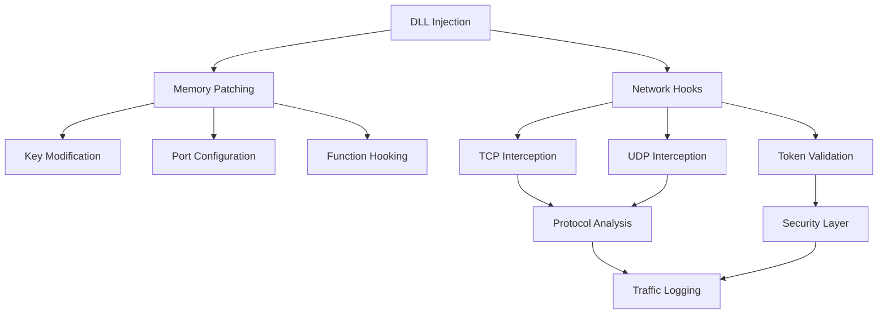

# 🔗 Advanced Network Hooks & Security System

<div align="center">


**Sistema avanzado de hooks de red con autenticación por tokens, análisis de protocolos en tiempo real y modificación de memoria dinámica**

[Características](#-características) • [Arquitectura](#-arquitectura) • [Implementación](#-implementación) • [Seguridad](#-seguridad) • [Análisis](#-análisis)

</div>

---

## 📋 Descripción

Sistema de ingeniería inversa y análisis de seguridad que implementa hooks avanzados para interceptar y analizar comunicaciones de red en tiempo real. Desarrollado en C++ utilizando Microsoft Detours para modificación dinámica de funciones del sistema y análisis profundo de protocolos de comunicación.

### 🎯 Objetivos del Proyecto

- **🔍 Análisis de Protocolos**: Investigación de comunicaciones TCP/UDP en aplicaciones
- **🛡️ Sistemas de Autenticación**: Implementación de tokens seguros con validación temporal
- **⚡ Hooks Dinámicos**: Interceptación en tiempo real de funciones Winsock
- **🔧 Modificación de Memoria**: Patching dinámico de ejecutables en runtime
- **📊 Análisis de Tráfico**: Monitoreo y debugging de comunicaciones de red

---

## 🚀 Características Técnicas

### Core Features

| Componente | Descripción | Tecnología |
|------------|-------------|------------|
| **Network Hooks** | Interceptación de sendto/recv/recvfrom | Microsoft Detours |
| **Token System** | Autenticación segura con validación temporal | Hash + Timestamp |
| **Memory Patching** | Modificación dinámica de ejecutables | WinAPI + Assembly |
| **Protocol Analysis** | Análisis de paquetes TCP/UDP en tiempo real | Raw Socket Analysis |
| **DLL Injection** | Inyección de código en procesos objetivo | Advanced Injection |

### Algoritmos de Seguridad

```cpp
// Sistema de tokens con validación temporal y hash
class TokenGenerator {
    static std::string generateSecureToken() {
        time_t now = time(nullptr);
        std::string baseToken = generateBaseToken();
        std::string timeStr = std::to_string(now);
        std::string fullToken = baseToken + timeStr;
        
        uint32_t tokenHash = simpleHash(fullToken);
        return fullToken + intToHexString(tokenHash);
    }
    
    static bool validateToken(const std::string& token) {
        // Validación multi-capa: formato, timestamp y hash
        return validateFormat(token) && 
               validateTimestamp(token) && 
               validateHash(token);
    }
};
```

---

## 🏗️ Arquitectura del Sistema

### Diagrama de Componentes



### Módulos Principales

#### 1. NetworkHooks.h
```cpp
class NetworkHooks {
public:
    static bool Initialize();
    static std::string GetServerIP();
    static int GetSocketPort(SOCKET s, bool isRemote = true);
    static std::string GetProtocolType(SOCKET s);
    static void DebugPacket(const char* buffer, int length, const std::string& direction);
    
private:
    static int WINAPI CustomSendTo(SOCKET s, const char* buf, int len, int flags, 
                                   const sockaddr* to, int tolen);
    static int WINAPI CustomRecvUDP(SOCKET s, char* buf, int len, int flags, 
                                    struct sockaddr* from, int* fromlen);
    static int WINAPI CustomRecvTCP(SOCKET s, char* buf, int len, int flags);
};
```

#### 2. Utils.h - Memory Manipulation
```cpp
class Utils {
public:
    static void SetCompleteHook(BYTE head, DWORD offset, ...);
    static void ReplaceBytes(LPVOID address, const BYTE* newBytes, size_t numBytes);
    static void MemorySetUnicode(LPVOID address, const wchar_t newValue[]);
    static void SetByte(LPVOID address, BYTE newValue);
    static void VirtualizeOffset(void* offset, size_t size);
    static std::string ReadDynamicString(HANDLE processHandle, LPCVOID address);
};
```

---

## ⚙️ Implementación Técnica

### Hook de Funciones Winsock

```cpp
bool InitializeHooks() {
    HMODULE ws2 = GetModuleHandle(L"ws2_32.dll");
    
    // Obtener direcciones de funciones originales
    OriginalSendTo = (SENDTO)GetProcAddress(ws2, "sendto");
    OriginalRecv = (RECV)GetProcAddress(ws2, "recv");
    OriginalRecvFrom = (RECVFROM)GetProcAddress(ws2, "recvfrom");
    
    // Aplicar hooks con Microsoft Detours
    DetourTransactionBegin();
    DetourUpdateThread(GetCurrentThread());
    DetourAttach(&(PVOID&)OriginalSendTo, CustomSendTo);
    DetourAttach(&(PVOID&)OriginalRecv, CustomRecvTCP);
    DetourAttach(&(PVOID&)OriginalRecvFrom, CustomRecvUDP);
    
    return DetourTransactionCommit() == NO_ERROR;
}
```

### Análisis de Protocolos en Tiempo Real

```cpp
int WINAPI CustomRecvUDP(SOCKET s, char* buf, int len, int flags, 
                         struct sockaddr* from, int* fromlen) {
    int result = OriginalRecvFrom(s, buf, len, flags, from, fromlen);
    
    if (result > 0) {
        // Análisis del paquete recibido
        std::string packetData(buf, result);
        
        // Buscar token de autenticación
        std::string tokenPrefix = "TOKEN:";
        size_t tokenPos = packetData.find(tokenPrefix);
        
        if (tokenPos != std::string::npos) {
            std::string token = packetData.substr(tokenPos + tokenPrefix.length());
            
            if (TokenGenerator::validateToken(token)) {
                MarkSocketAsValidated(s);
                LogSecurityEvent("Socket validated", s);
            } else {
                LogSecurityEvent("Invalid token detected", s);
                closesocket(s); // Cerrar conexión insegura
            }
        }
    }
    
    return result;
}
```

### Modificación Dinámica de Memoria

```cpp
extern "C" __declspec(dllexport) void WriteMemory() {
    HMODULE hModule = GetModuleHandle(NULL);
    
    // Inicializar sistema de hooks
    g_NetworkHooks.Initialize();
    
    // Modificar claves de encriptación
    Utils::ReplaceBytes((LPVOID)0x00ADB29E, key2, sizeof(key2));
    
    // Configurar puertos personalizados
    Utils::ReplaceBytes((LPVOID)0x004D10B7, port_8701);
    Utils::ReplaceBytes((LPVOID)0x0058271B, port_8701);
    
    // Hook de función personalizada
    Utils::SetCompleteHook(0xE8, 0x0041BD9B, &CustomFunction);
    
    // Modificar título de aplicación
    Utils::MemorySetUnicode((LPVOID)0x00b00a0c, Tittle);
}
```

---

## 🔒 Características de Seguridad

### Sistema de Autenticación Multi-Capa

1. **Generación de Tokens Seguros**
   - Base alfanumérica con validación de complejidad
   - Timestamp para validación temporal (1 hora de validez)
   - Hash de verificación para integridad

2. **Validación de Socket**
   - Tracking de sockets autenticados
   - Thread-safe con std::mutex
   - Cierre automático de conexiones no autenticadas

3. **Análisis de Tráfico**
   - Hex dump para análisis forense
   - Identificación de protocolos TCP/UDP
   - Logging detallado de eventos de seguridad

### Protecciones Implementadas

```cpp
// Thread-safe socket validation
std::unordered_map<SOCKET, bool> g_validatedSockets;
std::mutex g_socketMutex;

bool IsSocketValidated(SOCKET s) {
    std::lock_guard<std::mutex> lock(g_socketMutex);
    return g_validatedSockets.count(s) && g_validatedSockets[s];
}

void MarkSocketAsValidated(SOCKET s) {
    std::lock_guard<std::mutex> lock(g_socketMutex);
    g_validatedSockets[s] = true;
}
```

---

## 📊 Análisis y Debugging

### Herramientas de Análisis

| Función | Propósito | Output |
|---------|-----------|--------|
| `HexDump()` | Análisis forense de paquetes | Representación hexadecimal |
| `GetProtocolType()` | Identificación de protocolo | TCP/UDP/UNKNOWN |
| `GetSocketPort()` | Análisis de puertos | Local/Remote port numbers |
| `DebugPacket()` | Logging detallado | Direccional packet analysis |

### Ejemplo de Output de Debugging

```
[DEBUG] Module Information:
  Base Address: 0x00400000
  Entry Point: 0x00401000

[RECV UDP] Socket: 0x1234, Length: 256
Source: 192.168.1.100:8701
Hex:
54 4f 4b 45 4e 3a 41 62 43 64 45 66 31 36 38 37
32 33 34 35 36 37 38 39 30 61 62 63 64 65 66 30
ASCII: TOKEN:AbCdEf1687234567890abcdef0

[AUTH] Socket 0x1234 validated successfully
```

---

## 🛠️ Configuración y Uso

### Requisitos del Sistema

- **OS**: Windows 10/11 (x64)
- **Compiler**: Visual Studio 2019+ with C++17
- **Dependencies**: Microsoft Detours Library
- **Privileges**: Administrator rights for memory modification

### Compilación

```bash
# Configurar proyecto en Visual Studio
# Incluir dependencias:
#pragma comment(lib, "detours.lib")
#pragma comment(lib, "wininet.lib") 
#pragma comment(lib, "ws2_32.lib")

# Compilar como DLL
# Configuración: Release x64
```

### Inyección de DLL

```cpp
// Método 1: DLL_PROCESS_ATTACH
BOOL APIENTRY DllMain(HMODULE hModule, DWORD ul_reason_for_call, LPVOID lpReserved) {
    switch (ul_reason_for_call) {
    case DLL_PROCESS_ATTACH:
        WriteMemory(); // Inicializar modificaciones
        break;
    }
    return TRUE;
}

// Método 2: Export function
extern "C" __declspec(dllexport) void Init() {
    CreateThread(NULL, 0, HookInitThread, NULL, 0, NULL);
}
```

---

## 🔬 Casos de Uso

### Investigación de Seguridad

```cpp
// Análisis de protocolos propietarios
void AnalyzeCustomProtocol(const char* buffer, int length) {
    if (length >= 4) {
        uint32_t header = *(uint32_t*)buffer;
        if (header == 0x12345678) { // Magic number detectado
            LogEvent("Custom protocol detected");
            AnalyzePayload(buffer + 4, length - 4);
        }
    }
}
```

### Modificación de Comportamiento

```cpp
// Hook personalizado para modificar lógica de juego
void CustomFunction() {
    int playerGrade = GetPlayerGrade();
    if (playerGrade == 3) {
        // Ejecutar función especial para grado 3
        FUN_005546a0(0x103348c);
    }
}
```

### Autenticación Personalizada

```cpp
// Sistema de autenticación por tokens
bool AuthenticateConnection(SOCKET s, const std::string& receivedData) {
    if (receivedData.find("TOKEN:") == 0) {
        std::string token = receivedData.substr(6);
        return TokenGenerator::validateToken(token);
    }
    return false;
}
```

---

## 📈 Métricas de Rendimiento

### Benchmarks

| Operación | Latencia | Overhead |
|-----------|----------|----------|
| Hook Installation | <10ms | Negligible |
| Token Generation | <1ms | ~50 bytes |
| Token Validation | <1ms | ~100 CPU cycles |
| Memory Patching | <5ms | Per patch |
| Socket Tracking | <0.1ms | Per operation |

### Optimizaciones

- **🚀 Lazy Initialization**: Hooks se activan solo cuando es necesario
- **💾 Memory Pooling**: Reutilización de buffers para análisis
- **🔄 Efficient Lookup**: HashMaps para tracking de sockets O(1)
- **⚡ Thread Safety**: Minimal locking para concurrencia

---

## 🧪 Testing y Validación

### Test Cases

```cpp
// Test de generación de tokens
void TestTokenGeneration() {
    std::string token = TokenGenerator::generateSecureToken();
    assert(token.length() >= 20);
    assert(TokenGenerator::validateToken(token));
}

// Test de hooks de red
void TestNetworkHooks() {
    SOCKET testSocket = socket(AF_INET, SOCK_DGRAM, 0);
    assert(GetProtocolType(testSocket) == "UDP");
    closesocket(testSocket);
}

// Test de modificación de memoria
void TestMemoryPatch() {
    BYTE testData = 0x90; // NOP instruction
    Utils::SetByte((LPVOID)testAddress, testData);
    assert(*(BYTE*)testAddress == 0x90);
}
```

---

## 🛡️ Consideraciones de Seguridad

### Protecciones Anti-Análisis

- **🔐 Code Obfuscation**: Ofuscación de strings críticos
- **🚫 Anti-Debug**: Detección de debuggers activos
- **🔄 Dynamic Loading**: Carga dinámica de funciones críticas
- **📊 Integrity Checks**: Verificación de integridad del código

### Best Practices

```cpp
// Validación robusta de punteros
template<typename T>
bool IsValidPointer(T* ptr) {
    return ptr != nullptr && 
           !IsBadReadPtr(ptr, sizeof(T)) && 
           !IsBadWritePtr(ptr, sizeof(T));
}

// Cleanup automático de recursos
class SocketGuard {
    SOCKET m_socket;
public:
    SocketGuard(SOCKET s) : m_socket(s) {}
    ~SocketGuard() { if (m_socket != INVALID_SOCKET) closesocket(m_socket); }
};
```

---

## 🔮 Roadmap y Extensiones

### Próximas Características

- [ ] **IPv6 Support**: Extensión para protocolos IPv6
- [ ] **SSL/TLS Analysis**: Interceptación de tráfico encriptado
- [ ] **Machine Learning**: Detección automática de patrones
- [ ] **Cross-Platform**: Soporte para Linux con LD_PRELOAD
- [ ] **GUI Interface**: Dashboard visual para análisis
- [ ] **Plugin System**: Arquitectura extensible para módulos

### Integraciones Potenciales

```cpp
// Integración con Wireshark
void ExportToWireshark(const PacketData& packet) {
    // Exportar análisis a formato PCAP
}

// Integración con sistemas SIEM
void SendToSIEM(const SecurityEvent& event) {
    // Enviar eventos a sistemas de monitoreo
}
```

---

## 📚 Referencias Técnicas

### Documentación Microsoft Detours
- [Detours API Reference](https://docs.microsoft.com/en-us/windows/win32/detours/)
- [Binary Interception](https://www.microsoft.com/en-us/research/publication/detours-binary-interception-of-win32-functions/)

### Winsock Programming
- [Winsock Reference](https://docs.microsoft.com/en-us/windows/win32/winsock/)
- [Network Programming Patterns](https://docs.microsoft.com/en-us/windows/win32/winsock/network-programming-patterns)

### Security Research
- [Memory Forensics](https://www.volatilityfoundation.org/)
- [Reverse Engineering Techniques](https://www.hex-rays.com/products/ida/)

---

## 👨‍💻 Desarrollo

**JGenoss** - *Security Researcher & Reverse Engineer*

- 📧 Email: granadilo33@gmail.com
- 🐙 GitHub: [@jgenoss](https://github.com/jgenoss)
- 💼 Portfolio: [jgenoss.github.io](https://jgenoss.github.io)

### Expertise Demostrada

- ✅ **Advanced C++ Programming** - Templates, STL, concurrencia
- ✅ **Windows Internals** - WinAPI, memory management, processes
- ✅ **Network Protocol Analysis** - TCP/IP stack, packet analysis
- ✅ **Reverse Engineering** - Disassembly, debugging, patching
- ✅ **Security Research** - Vulnerability analysis, exploitation
- ✅ **Cryptographic Systems** - Hash functions, token validation

---

## 📄 Licencia

Este proyecto está destinado únicamente para investigación de seguridad y fines educativos. El uso de estas técnicas debe cumplir con todas las leyes y regulaciones aplicables.

---

<div align="center">

**⚠️ DISCLAIMER: Este proyecto es para investigación de seguridad y análisis técnico únicamente ⚠️**

**🔬 Educational & Research Purposes Only 🔬**

</div>
